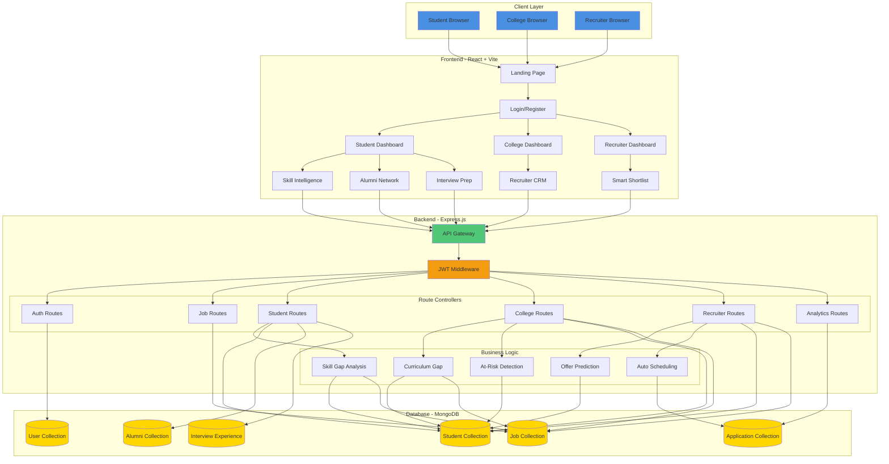
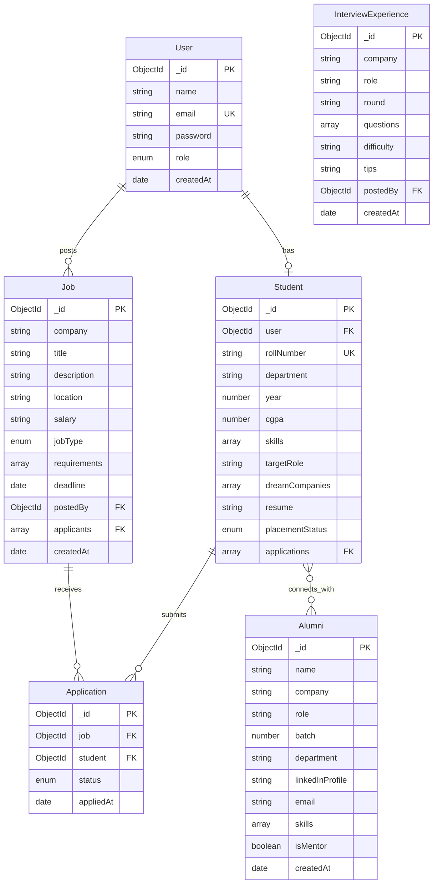
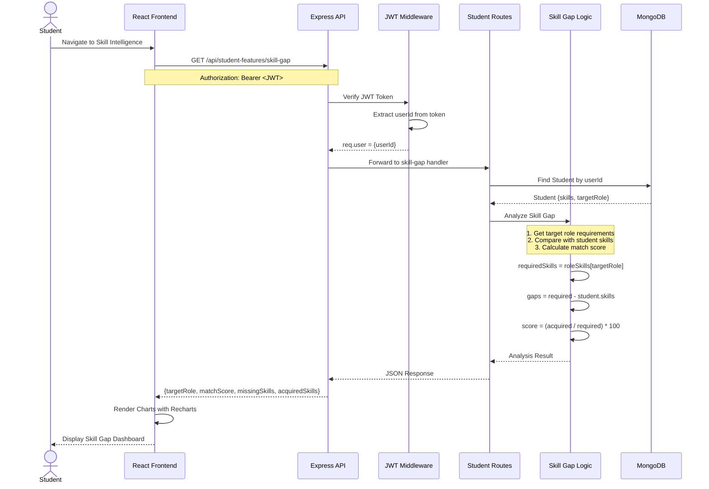
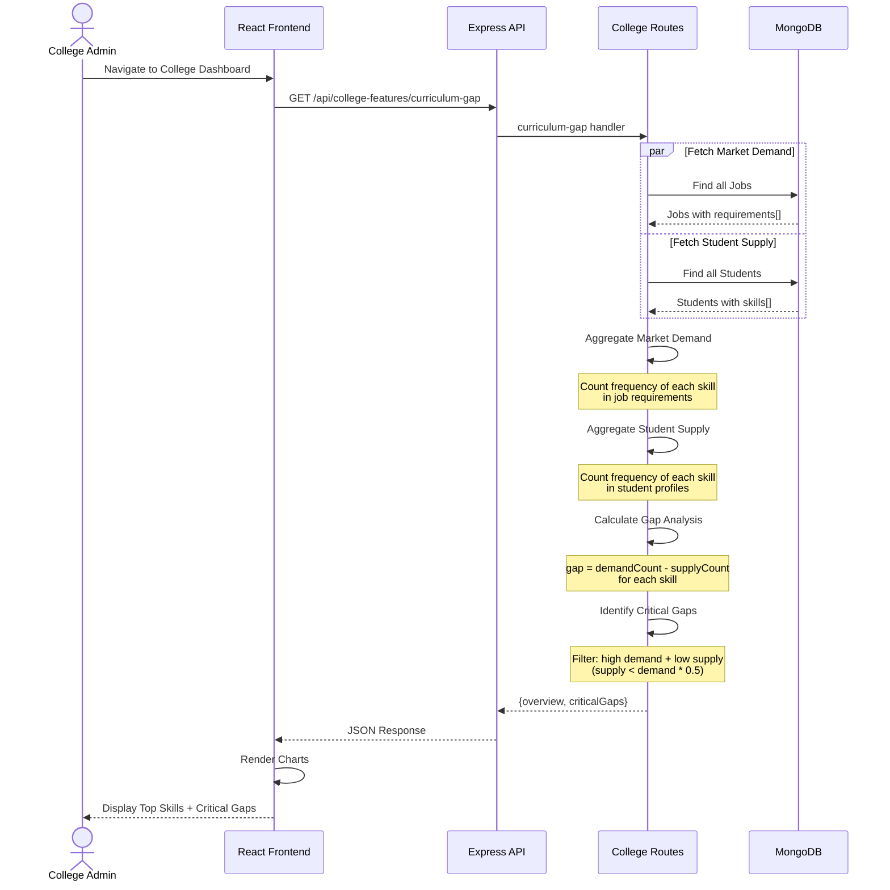
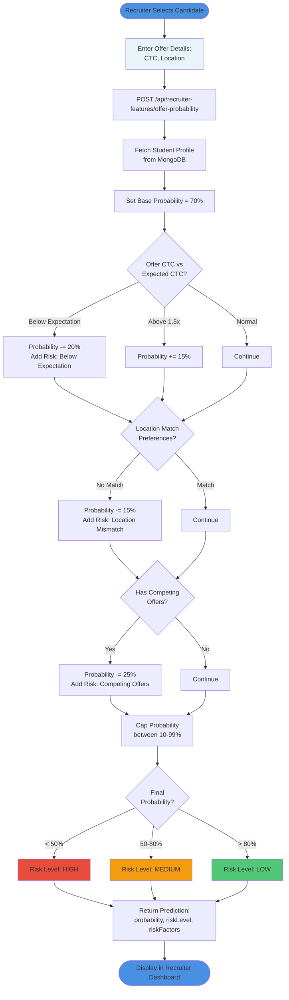
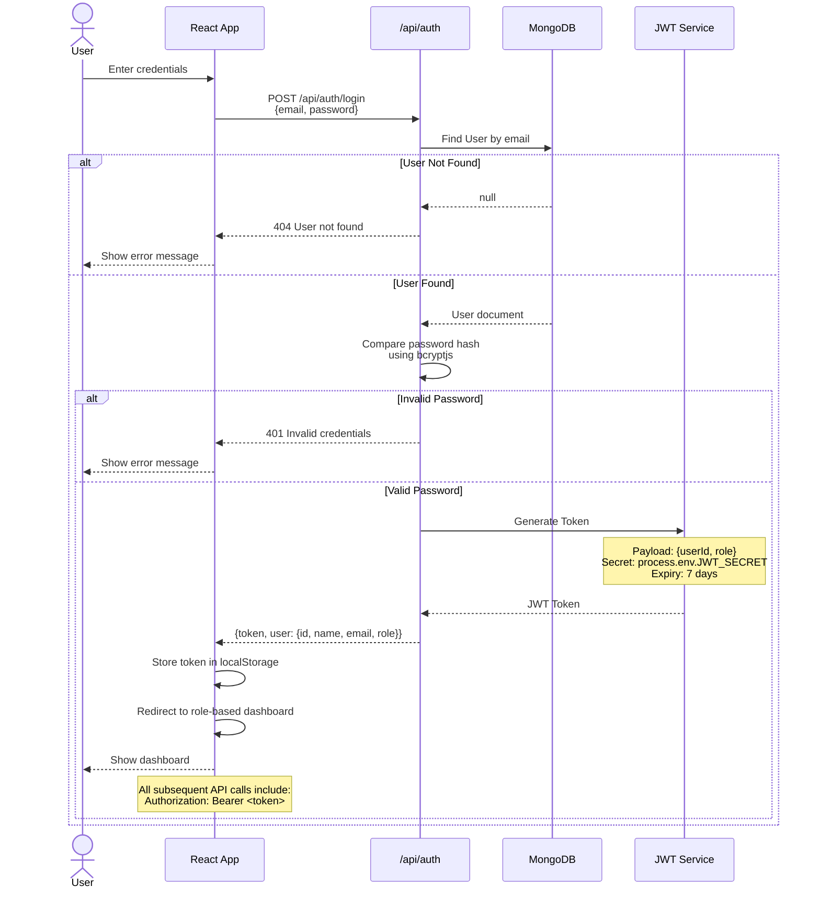
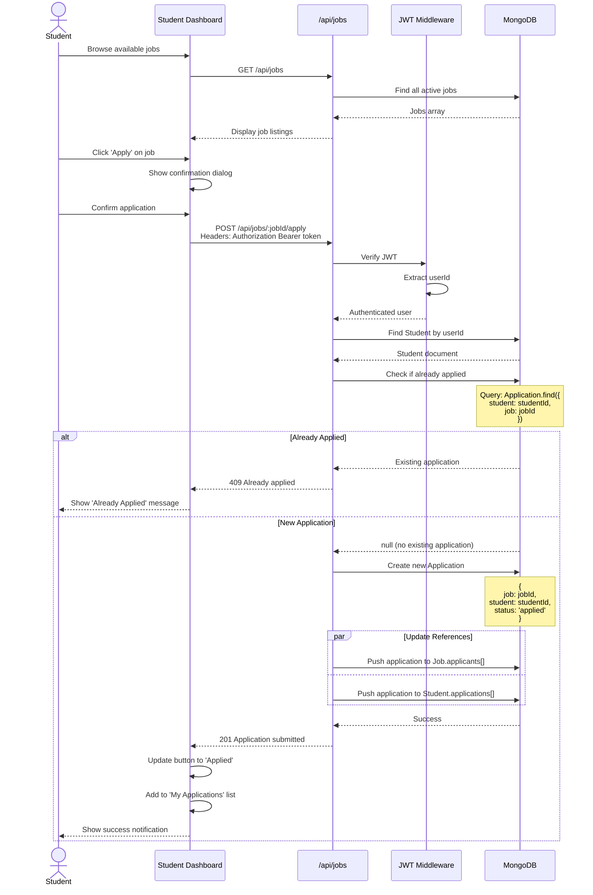
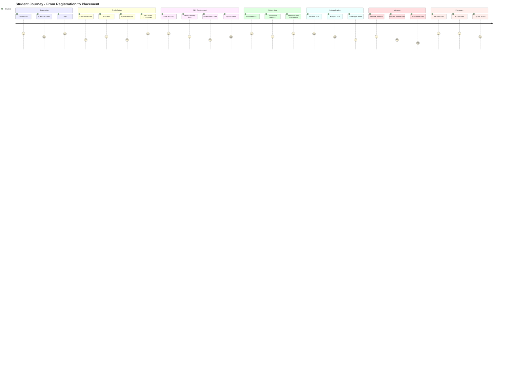

# System Architecture Diagrams
## Skill Gap Analyser & Placement Intelligence Platform

---

## 1. High-Level System Architecture



---

## 2. Database Schema & Relationships



---

## 3. Student Skill Gap Analysis Flow



---

## 4. College Curriculum Gap Analysis Flow



---

## 5. Recruiter Offer Acceptance Prediction Flow



---

## 6. Authentication & Authorization Flow



---

## 7. At-Risk Student Detection Flow

```mermaid
flowchart TD
    Start([Trigger: College Admin<br/>Views At-Risk Radar]) --> Request[GET /api/college-features/at-risk]
    
    Request --> Fetch[Fetch all Unplaced Students<br/>from MongoDB]
    Fetch --> Loop{For each<br/>student}
    
    Loop -->|Process| Init[Initialize:<br/>riskFactors = []<br/>riskLevel = null]
    
    Init --> CheckCGPA{CGPA < 7?}
    CheckCGPA -->|Yes| AddCGPA[Add 'Low CGPA'<br/>to riskFactors]
    CheckCGPA -->|No| CheckSkills
    
    AddCGPA --> CheckSkills
    CheckSkills{Skills count<br/>< 3?}
    CheckSkills -->|Yes| AddSkills[Add 'Low Skill Count'<br/>to riskFactors]
    CheckSkills -->|No| CheckApps
    
    AddSkills --> CheckApps
    CheckApps{Applications<br/>> 10?}
    CheckApps -->|Yes| AddApps[Add 'High Rejection Rate'<br/>to riskFactors]
    CheckApps -->|No| Classify
    
    AddApps --> Classify
    Classify{riskFactors<br/>length >= 2?}
    Classify -->|Yes| Critical[riskLevel = 'Critical']
    Classify -->|No, but > 0| Moderate[riskLevel = 'Moderate']
    Classify -->|0 factors| Skip[Skip student]
    
    Critical --> AddToList
    Moderate --> AddToList
    AddToList[Add to atRiskList]
    
    AddToList --> Loop
    Skip --> Loop
    
    Loop -->|All processed| Sort[Sort by riskLevel<br/>Critical first]
    Sort --> Response[Return atRiskList<br/>with student details]
    Response --> Display([Display in UI<br/>with action buttons])
    
    style Start fill:#4A90E2
    style Critical fill:#E74C3C
    style Moderate fill:#F39C12
    style Display fill:#50C878
```

---

## 8. Job Application Process Flow



---

## 9. Complete User Journey Map



---

## Legend

### Colors
- 🟦 **Blue**: User/Client interactions
- 🟩 **Green**: Successful operations
- 🟨 **Yellow**: In-progress/Moderate
- 🟥 **Red**: High risk/Critical
- 💛 **Gold**: Database entities

### Abbreviations
- **API**: Application Programming Interface
- **JWT**: JSON Web Token
- **CRM**: Customer Relationship Management
- **ROI**: Return on Investment
- **SDE**: Software Development Engineer
- **CGPA**: Cumulative Grade Point Average
